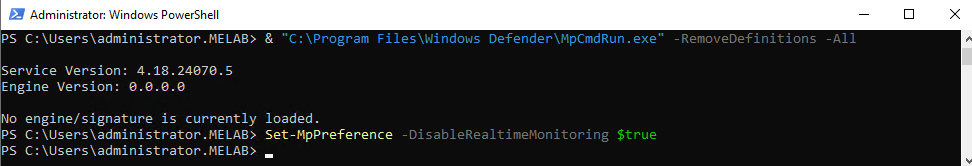
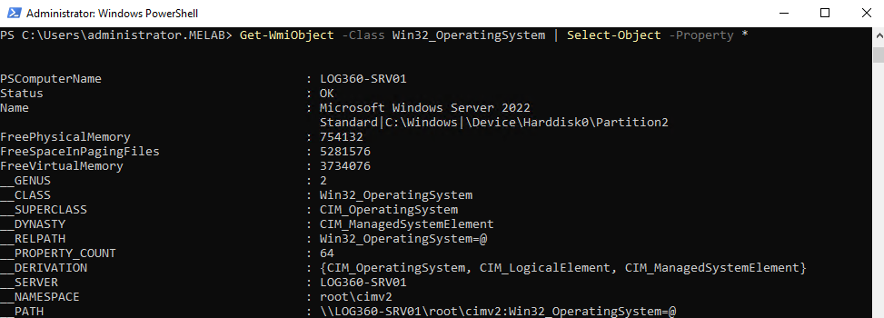
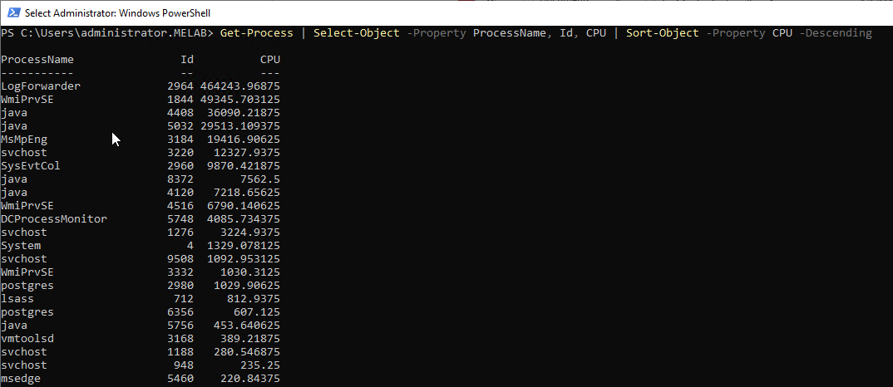
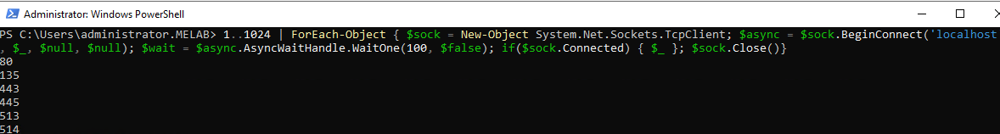
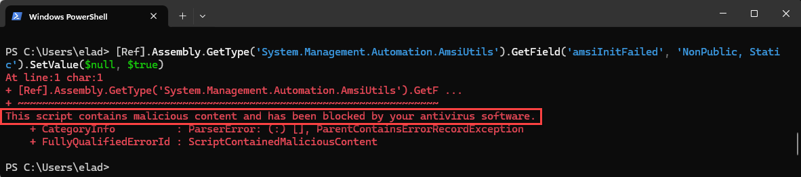
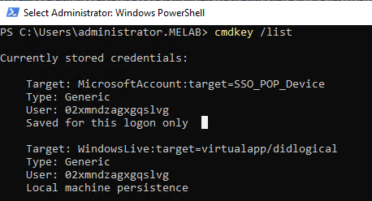
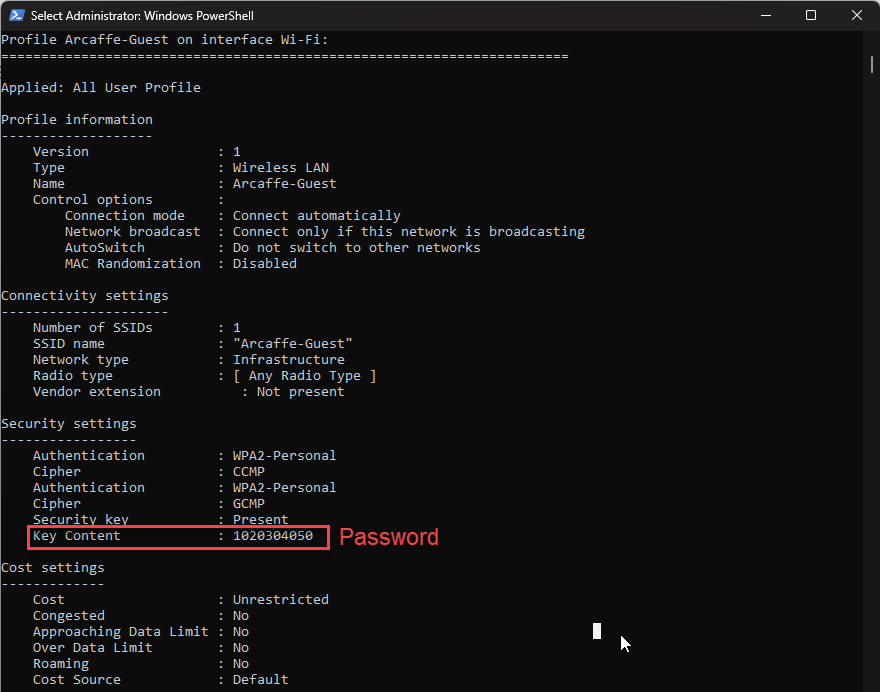

## 1. Disable Windows Defender Realtime Monitoring
This command disables Windows Defender's real-time monitoring.
```powershell
& "C:\Program Files\Windows Defender\MpCmdRun.exe" -RemoveDefinitions -All
Set-MpPreference -DisableRealtimeMonitoring $true
```

---
## 2. Get Detailed OS Information
This command retrieves all properties of the operating system.
```powershell
Get-WmiObject -Class Win32_OperatingSystem | Select-Object -Property *
```

---
## 3. Network Interface Information
This command retrieves network interface configuration, including IPv4 and IPv6 addresses.
```powershell
Get-NetIPConfiguration
```

---
## 4. List Processes by CPU Usage
This command retrieves running processes and sorts them by CPU usage in descending order.
```powershell
Get-Process | Select-Object -Property ProcessName, Id, CPU | Sort-Object -Property CPU -Descending
```

---
## 5. Port Scanning
This script first retrieves all active TCP connections, showing their state, local address, port, and owning process.
It then performs a basic port scan on localhost, scanning ports 1 to 1024, and prints out any ports that are currently open.
```powershell
$tcpConnections = Get-NetTCPConnection | Select-Object -Property State, LocalAddress, LocalPort, OwningProcess
$tcpConnections
1..1024 | ForEach-Object {
   $sock = New-Object System.Net.Sockets.TcpClient
   $async = $sock.BeginConnect('localhost', $_, $null, $null)
   $wait = $async.AsyncWaitHandle.WaitOne(100, $false)
   if($sock.Connected) {
       Write-Host "$_"
   }
   $sock.Close()
}
```

---
## 6. Bypass Execution Policy and Run Script
What is [PowerShell Gallery](https://www.powershellgallery.com/)? </br>
This command temporarily bypasses the script execution policy and runs a PowerShell script.
```powershell
Set-ExecutionPolicy Bypass -Scope Process; .\script.ps1
```


---
## 7. Bypass Execution Policy Temporarily
This command temporarily bypasses the execution policy for running scripts and then reverts it.
```powershell
$policy = Get-ExecutionPolicy;
Set-ExecutionPolicy -ExecutionPolicy Bypass -Scope Process;
# Scriptofyourchoice;
Set-ExecutionPolicy -ExecutionPolicy $policy -Scope Process
```
---
## 8. List Stored Credentials
This command lists all stored credentials.
```powershell
cmdkey /list
```

---
## 9. Execute PowerShell Script from Memory
This command reads the content of a PowerShell script from a file and executes it in memory.
```powershell
# Read the content of the script from the file in memory
$code = [System.IO.File]::ReadAllText('C:\temp\script1.ps1')
# Execute the PowerShell script in memory
Invoke-Expression $code
```
---
## 10. Extract Wi-Fi Profile Names and Passwords
This command extracts Wi-Fi profile names and passwords stored on the computer.
```powershell
netsh wlan show profiles |
Select-String -Pattern 'All User Profile' |
ForEach-Object {
   $profileName = ($_ -replace 'All User Profile\s*:\s*','').Trim()
   netsh wlan show profile name="$profileName" key=clear
}
```


